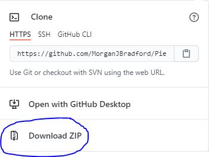
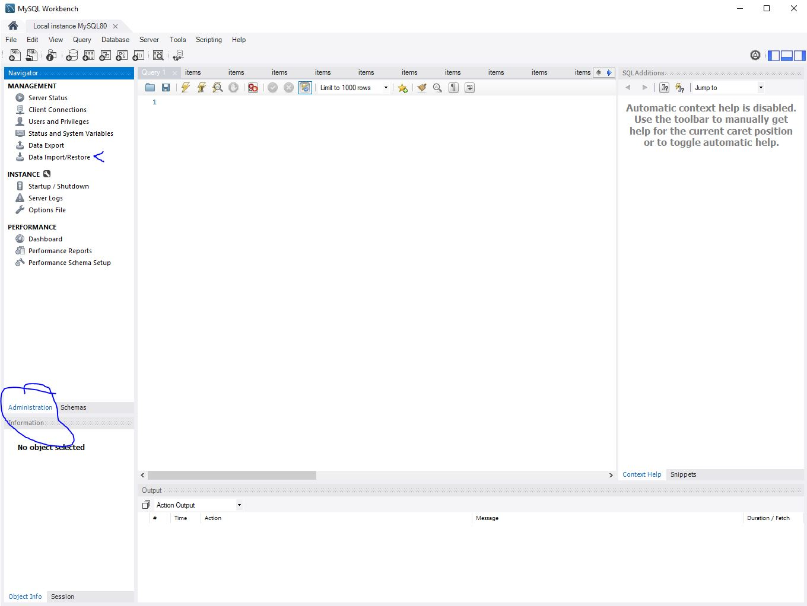
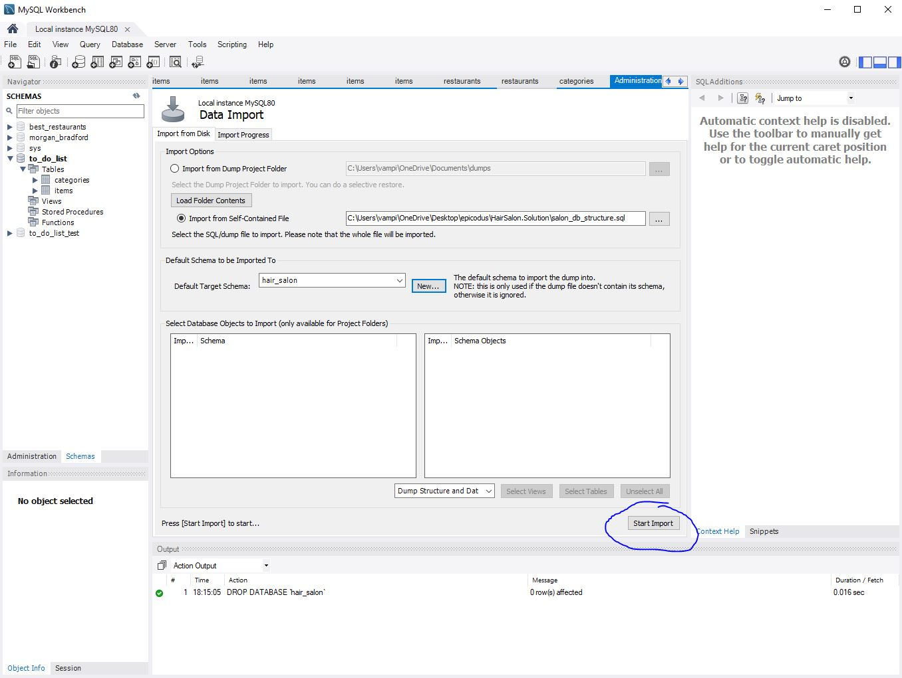
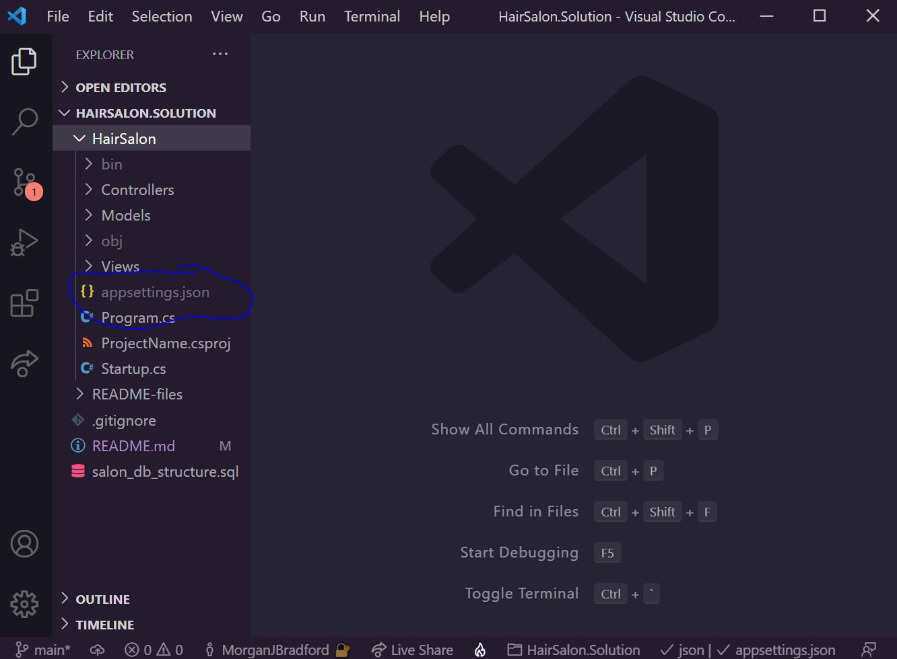

## 
Eac Claire's Salon

#### 
 *A website created for tracking employees and their clients* 
 
***
Morgan Bradford***
   

 

___
## 🚩 *Description*:    
### *Use this website to create and store a list a your business' employees(name, specialty), as well each employee's clients(name). This website will allow employers to keep track of their current employees and cliental.*

## 🔧 *Setup/Installation instructions:*
#### 🌐 From the web:
* Go to my GitHub repository, using following [URL](https://github.com/MorganJBradford/HairSalon.Solution.git).
* Click the "Code"  and click the 'Download zip' option .
* Unzip the file, navigate to the `Models` directory to check code or to the `ModelTests` directory to see tests.
#### ⚙️ From the terminal: 
* Clone my repository from GitHub using `git clone https://github.com/MorganJBradford/HairSalon.Solution.git` in your terminal or GitBash
* Navigate to the downloaded folder using ***cd*** command
* Execute **code .** command in your terminal and it will open all source code in your code editor.    
⚠️ *Note: To run this project locally you will need to have .NET Core. You can check if you have .NET Core by running dotnet --version in the command line. If you do not have .NET Core please find more information and download [here](https://dotnet.microsoft.com/download/dotnet)*

####  🖥️ View website:

1. Create Database with MySQL Workbench:

* Open MySql, navigate to the administration tab (circled in the photo below), then double click on "Data Import/Restore" (see arrow in photo):

* A page called Data Import will open on MySQL Workbench. For _Import options_ select "Import from Self-Contained file", then select the file labeled "salon_db_structure.sql". This file will be in the top level of this projects directory. Next, in the _Default Schema to be Imported_ click the button "New...", you may name your scheme as you prefer, for the purposes of instruction mine is labeled hair_salon. When your view resembles the image below, select "Start Import" (circled in the photo below):

2. Connect Database to HairSalon.Solution

* Create a file named "appsettings.json" in the top level of the production directory 'HairSalon.Solution/HairSalon'. 
**Uploading to your own repository**: If using vscode and "appsettings.json" is is not grayed out like in the image below, you may need to commit the .gitignore file included in this project first. If "appsettings.json" is not grayed out **do not upload your project**

* Navigate to your appsettings.json and paste the following template code:

``{
  "ConnectionStrings": {
      "DefaultConnection": "Server=localhost;Port=3306;database=[database_name];uid=root;pwd=[password];"
  }
}``

If you are using a server other than the default server, you will need to change the Port number. Otherwise, we will update the code to put in our database information and password. Replace "\[database_name]" with the "hair_salon" and "\[password]" with your password. **Again this is private and should be included in a .gitignore.** The final result should look like the following:

``{
  "ConnectionStrings": {
      "DefaultConnection": "Server=localhost;Port=3306;database=hair_salon;uid=root;pwd=mydbpassword;"
  }
}``

3. Run Application

* From the top level directory enter 'cd HairSalon' in the command line.
* Run the command 'dotnet restore' to download dependencies required to run the project.
* Next, enter 'dotnet run' the in command line. You should a message similar to the following populate in your terminal:

> Hosting environment: Production
> Content root path: C:\Users\vampi\OneDrive\Desktop\epicodus\HairSalon.Solution\HairSalon
> Now listening on: http://localhost:5000
> Now listening on: https://localhost:5001
> Application started. Press Ctrl+C to shut down.

* Lastly, follow the link "http://localhost:5000" either via holding the 'ctrl' and clicking the link (PC), or by holding 'cmd' and clicking the link (Mac).

## 🛠️ *Technologies used:*
* C# 9
* .NET Core v5.0
* ASP.NET Core MVC
* Entity
* MySQL Workbench 8.0 CE
* REPL
* Git and GitHub

## 🐛 *Known bugs:*
* No known bugs at this time.
* You you find any bugs, _please_ contact me via my email below.

## 📬 Contact Information
#### For any questions *[email Morgan](mailto:morganjbradford95@gmail.com)*

## 📘 *License and copyright:*

> ***© Morgan Bradford 2021***  
> ⚖️ **